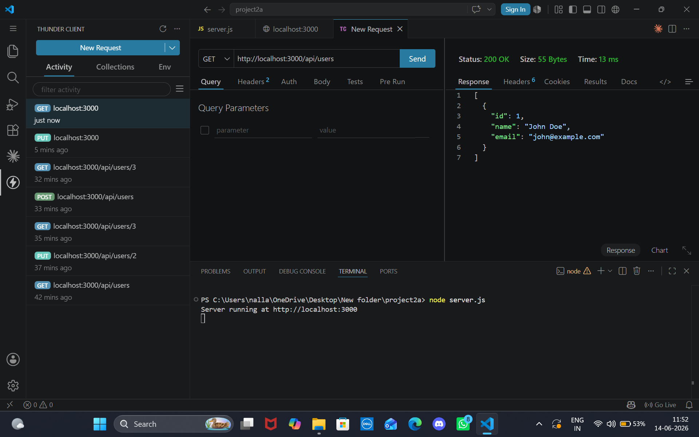
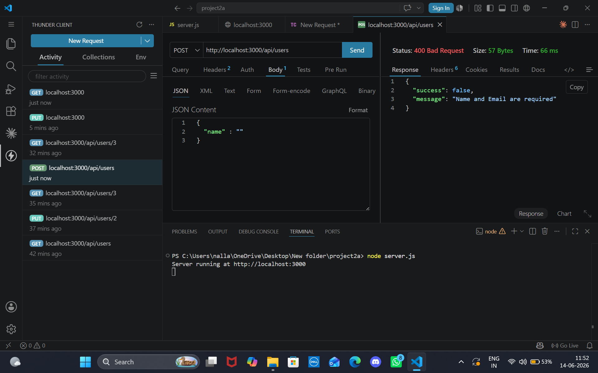
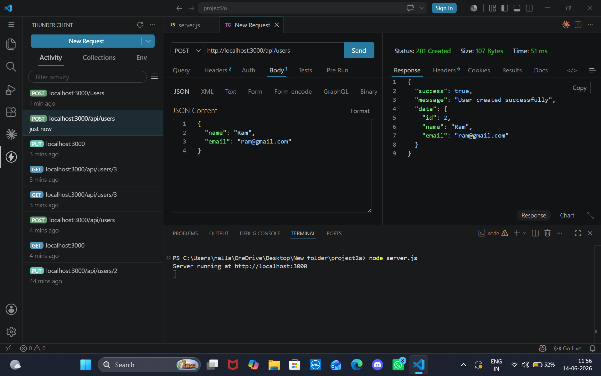
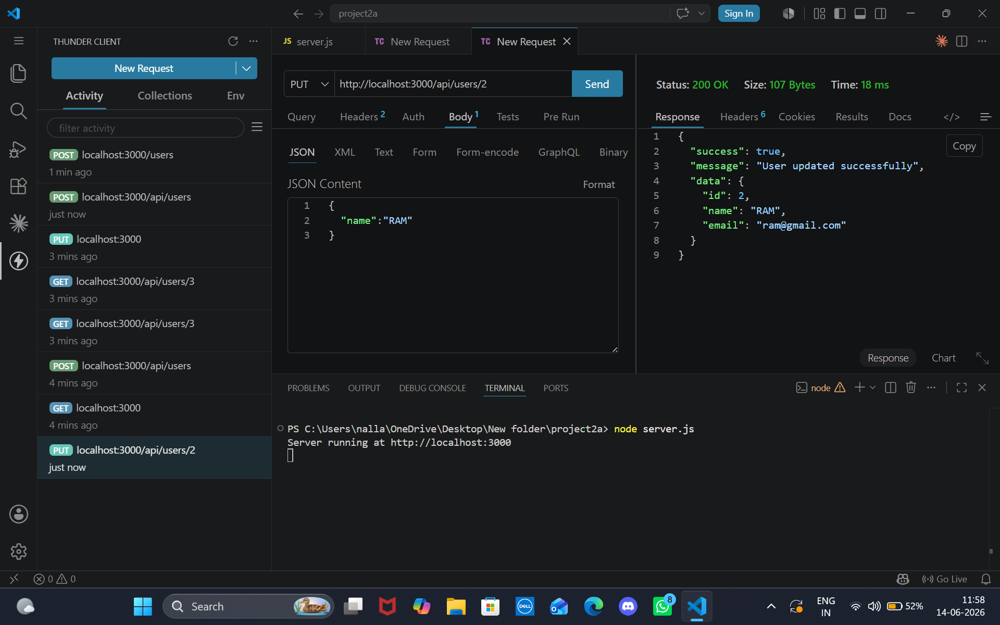
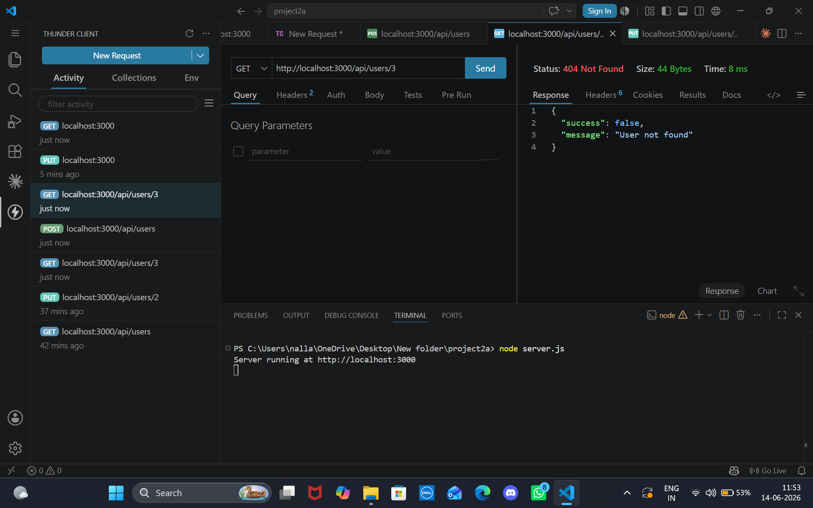
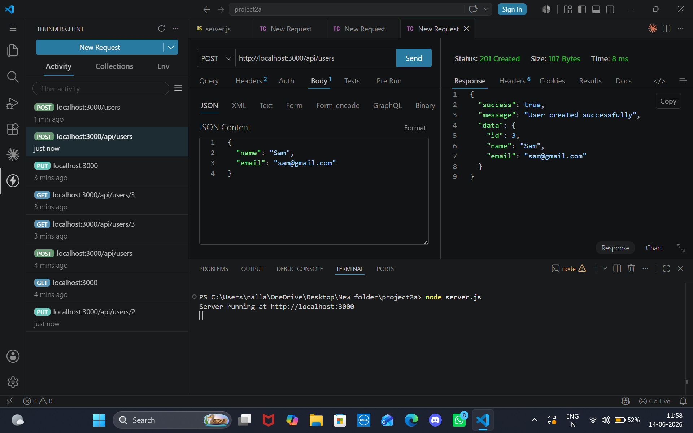
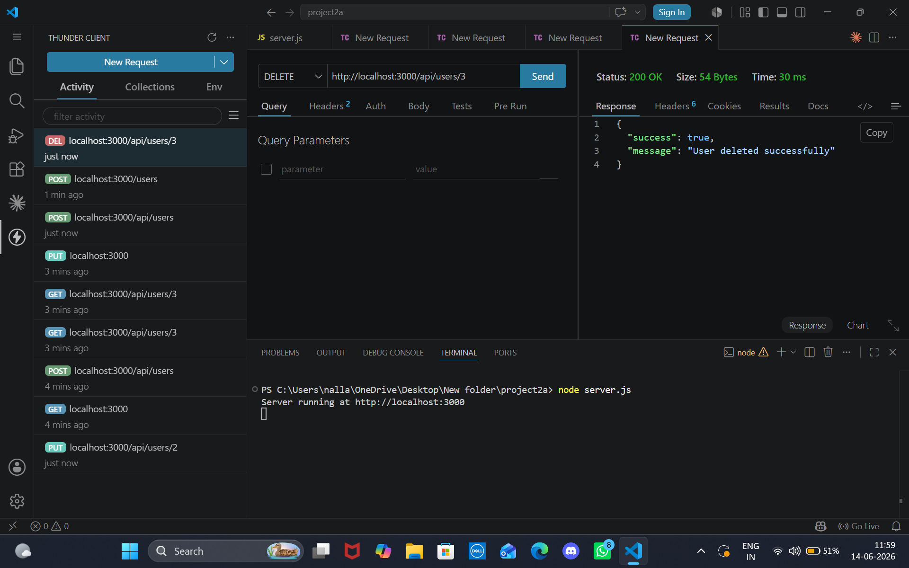
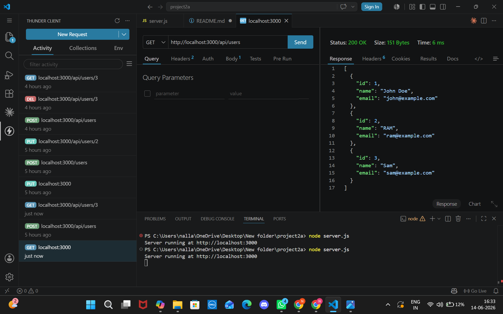

# API | Backend Service

## 🚀 Overview
API is a backend service built with **Node.js and Express**.  
It provides RESTful endpoints for managing users with full CRUD functionality.  
This project was developed as part of **DecodeLabs Internship Project 2**.

## ✨ Features
- RESTful API endpoints (GET, POST, PUT, DELETE)
- Input validation and error handling
- Proper HTTP status codes (200, 201, 400, 404)
- JSON responses for frontend integration
- Tested with Thunder Client inside VS Code

## 🛠️ Tech Stack
- Node.js
- Express.js
- Middleware (express.json)
- Thunder Client (API testing)

## 📂 Project Structure
project2/
├── node_modules/       # Dependencies
├── package.json        # Project metadata & scripts
├── package-lock.json   # Dependency lock file
├── server.js           # Entry point with all routes
├── /images             # Thunder Client screenshots (GET, POST, PUT, DELETE)
└── README.md           # Project documentation

## ⚙️ Setup Instructions
1. Clone the repository:
   ```bash
   git clone https://github.com/neha5x3/Task-2-NallaNeha.git
2. Navigate to the project folder:
    bash
    cd Task-2-NallaNeha
3. Install dependencies:
    bash
    npm install
4. Start the server:
    bash
    node server.js
5. Test endpoints using Thunder Client (VS Code extension):

    GET http://localhost:3000/api/users → Retrieve all users
    GET http://localhost:3000/api/users/1 → Retrieve user by ID
    POST http://localhost:3000/api/users → Create new user
    PUT http://localhost:3000/api/users/1 → Update user
    DELETE http://localhost:3000/api/users/1 → Delete user


## 📸 Screenshots
1. GET All Users (Available)
    

2. POST Create User (Validation Error)
    

3. POST Create User (Success)
    

4. PUT Update User
    

5. GET User By ID
    

6. GET User By ID (Not Found)
     

7. POST Create Another User
    

8. DELETE User By ID
    

9. GET All Users (After Delete)
     

## ✅ Testing
Verified all endpoints with Thunder Client
Checked error handling for invalid requests
Confirmed proper status codes (200, 201, 400, 404)

📜 License
MIT License

👨‍💻 Author
Name: Nalla Neha
Education: B.Tech CSE (DecodeLabs Internship Project 2)
GitHub: https://github.com/neha5x3 